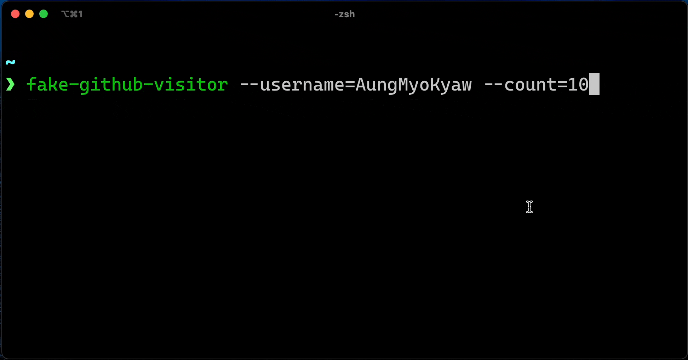

# fake-github-visitor-count

> fake github visitor count



## Usage

> fake visitor count for github visitor count badge

u can install this badge like this

[](https://github.com/AungMyoKyaw)

```txt
[](https://github.com/AungMyoKyaw)
```

### Installation

```
npm i -g fake-github-visitor-count
```

### start faking visitor count

```shell
Usage
    $ fake-github-visitor
Options
    --username
    --count [ max is 100 ]
Examples
    $ fake-github-visitor --username=AungMyoKyaw --count=10
```

> it will send every request with random user agent

## License

MIT © [Aung Myo Kyaw](https://github.com/AungMyoKyaw)
